**Predicting and Understanding Customer Churn with Random Forests**

In this project, I will be focusing on the Telco Customer Churn dataset. This is a sample dataset created by IBM to demonstrate features of the Watson Analytics platform, and is available here on the Watson Analytics Blog:
https://www.ibm.com/communities/analytics/watson-analytics-blog/guide-to-sample-datasets/

It can also be found on Kaggle as a public dataset with a bit more description:
https://www.kaggle.com/blastchar/telco-customer-churn/

A hypothetical telecom provider called Telco wishes to know about factors related to customer retention. They provide data about 7043 customers, including whether 'churned' (i.e. canceled their service and ceased to be Telco customers) within the last month.

My approach to this problem will be as follows: First, I will explore the data. I will look for any unusual or potentially erroneous observations. I will examine the distribution of each variable on its own and the pairwise relationships among candidate predictors. Everything except churn itself and customer ID can potentially be used to predict customer churn. I will train a random forest model that predicts the customer churn outcome and assess the model. Provided my model adequately predicts out-of-sample observations, I will go on to interpret the model. I will begin by identifying features which make a sizeable contribution to the quality of prediction on out-of-sample observations using the permutation variable importance method implemented in the rfpimp package and described here by Terence Parr, Kerem Turgutlu, Christopher Csiszar, and Jeremy Howard (2018):

http://explained.ai/rf-importance/

Focusing on the variables identified using this procedure, I will provide estimates of the effect of each variable on the probability of customer attrition using the partial dependence method described in this article by Guy Cafri and Barbara A. Bailey (2016):

http://www.jds-online.com/file_download/531/JDS150802%E6%A0%BC%E5%BC%8F%E6%AD%A3%E7%A2%BA%E7%89%88.pdf

Finally, I will discuss the implications of my findings for developing a customer retention strategy.

The data are provided to me in a CSV file. Before I can begin my analysis, I will read the data from the file into a pandas DataFrame.


```
import matplotlib
from statsmodels.graphics.mosaicplot import mosaic
import math

# available from https://github.com/shakedzy/dython/tree/master/dython
# https://towardsdatascience.com/the-search-for-categorical-correlation-a1cf7f1888c9
#os.chdir('C:/Users/Michael Nash/Documents/job search/2018/Github_proj/Telco churn')
import dython.nominal as dn
import os
import pandas
import numpy
# Seaborn visualization library
import seaborn as sns
from matplotlib import pyplot
os.chdir('C:/Users/Michael Nash/Documents/job search/2018/Github_proj/Telco churn')
#os.getcwd()
```


```
read_df = pandas.read_csv('WA_Fn-UseC_-Telco-Customer-Churn.csv')
read_df.head(5)
```


<div>
<style scoped>
    .dataframe tbody tr th:only-of-type {
        vertical-align: middle;
    }

    .dataframe tbody tr th {
        vertical-align: top;
    }

    .dataframe thead th {
        text-align: right;
    }
</style>
<table border="1" class="dataframe">
  <thead>
    <tr style="text-align: right;">
      <th></th>
      <th>customerID</th>
      <th>gender</th>
      <th>SeniorCitizen</th>
      <th>Partner</th>
      <th>Dependents</th>
      <th>tenure</th>
      <th>PhoneService</th>
      <th>MultipleLines</th>
      <th>InternetService</th>
      <th>OnlineSecurity</th>
      <th>...</th>
      <th>DeviceProtection</th>
      <th>TechSupport</th>
      <th>StreamingTV</th>
      <th>StreamingMovies</th>
      <th>Contract</th>
      <th>PaperlessBilling</th>
      <th>PaymentMethod</th>
      <th>MonthlyCharges</th>
      <th>TotalCharges</th>
      <th>Churn</th>
    </tr>
  </thead>
  <tbody>
    <tr>
      <th>0</th>
      <td>7590-VHVEG</td>
      <td>Female</td>
      <td>0</td>
      <td>Yes</td>
      <td>No</td>
      <td>1</td>
      <td>No</td>
      <td>No phone service</td>
      <td>DSL</td>
      <td>No</td>
      <td>...</td>
      <td>No</td>
      <td>No</td>
      <td>No</td>
      <td>No</td>
      <td>Month-to-month</td>
      <td>Yes</td>
      <td>Electronic check</td>
      <td>29.85</td>
      <td>29.85</td>
      <td>No</td>
    </tr>
    <tr>
      <th>1</th>
      <td>5575-GNVDE</td>
      <td>Male</td>
      <td>0</td>
      <td>No</td>
      <td>No</td>
      <td>34</td>
      <td>Yes</td>
      <td>No</td>
      <td>DSL</td>
      <td>Yes</td>
      <td>...</td>
      <td>Yes</td>
      <td>No</td>
      <td>No</td>
      <td>No</td>
      <td>One year</td>
      <td>No</td>
      <td>Mailed check</td>
      <td>56.95</td>
      <td>1889.5</td>
      <td>No</td>
    </tr>
    <tr>
      <th>2</th>
      <td>3668-QPYBK</td>
      <td>Male</td>
      <td>0</td>
      <td>No</td>
      <td>No</td>
      <td>2</td>
      <td>Yes</td>
      <td>No</td>
      <td>DSL</td>
      <td>Yes</td>
      <td>...</td>
      <td>No</td>
      <td>No</td>
      <td>No</td>
      <td>No</td>
      <td>Month-to-month</td>
      <td>Yes</td>
      <td>Mailed check</td>
      <td>53.85</td>
      <td>108.15</td>
      <td>Yes</td>
    </tr>
    <tr>
      <th>3</th>
      <td>7795-CFOCW</td>
      <td>Male</td>
      <td>0</td>
      <td>No</td>
      <td>No</td>
      <td>45</td>
      <td>No</td>
      <td>No phone service</td>
      <td>DSL</td>
      <td>Yes</td>
      <td>...</td>
      <td>Yes</td>
      <td>Yes</td>
      <td>No</td>
      <td>No</td>
      <td>One year</td>
      <td>No</td>
      <td>Bank transfer (automatic)</td>
      <td>42.30</td>
      <td>1840.75</td>
      <td>No</td>
    </tr>
    <tr>
      <th>4</th>
      <td>9237-HQITU</td>
      <td>Female</td>
      <td>0</td>
      <td>No</td>
      <td>No</td>
      <td>2</td>
      <td>Yes</td>
      <td>No</td>
      <td>Fiber optic</td>
      <td>No</td>
      <td>...</td>
      <td>No</td>
      <td>No</td>
      <td>No</td>
      <td>No</td>
      <td>Month-to-month</td>
      <td>Yes</td>
      <td>Electronic check</td>
      <td>70.70</td>
      <td>151.65</td>
      <td>Yes</td>
    </tr>
  </tbody>
</table>
<p>5 rows × 21 columns</p>
</div>


The data were read from the file successfully. The columns are intact. The values in the first row were correctly interpreted as column names. The rows have been assigned indices starting at zero. In order to use the categorical variables in this data set as features in a random forest, I need to convert them to dichotomous variables. One way to do this is with dummy coding, also known as one-hot encoding. A variable with k categories becomes k-1 dichotomous variables. The first dichotomous variable equals 'True' only for observations in category 1, the second only for observations in category 2, and so on to k-1. The kth category is denoted by all dummy coded variables being equal to 'False'. Here is the result:


```
 data_df = pandas.DataFrame(numpy.column_stack(
    [read_df['customerID'],
     read_df['gender'] == 'Female',
     read_df['SeniorCitizen'] == 1,
     read_df['Partner'] == 'Yes',
     read_df['Dependents'] == 'Yes',
     read_df['tenure'],
     read_df['PhoneService'] == 'Yes',
     read_df['MultipleLines'] == 'Yes',
     #read_df['InternetService'] != 'No',
     read_df['InternetService'] == 'DSL',
     read_df['InternetService'] == 'Fiber optic',
     read_df['OnlineSecurity'] == 'Yes',
     read_df['OnlineBackup'] == 'Yes',
     read_df['DeviceProtection'] == 'Yes',
     read_df['TechSupport'] == 'Yes',
     read_df['StreamingTV'] == 'Yes',
     read_df['StreamingMovies'] == 'Yes',
     read_df['Contract'] == 'One year',
     read_df['Contract'] == 'Two year',
     read_df['PaperlessBilling'] == 'Yes',
     read_df['PaymentMethod'] == 'Electronic check',
     read_df['PaymentMethod'] == 'Mailed check',
     read_df['PaymentMethod'] == 'Bank transfer (automatic)',
     read_df['MonthlyCharges'].astype('float'),
     read_df['TotalCharges'].convert_objects(convert_numeric=True),
     read_df['Churn'] == 'Yes'])
     , columns=['customerID','Female','SeniorCitizen','Partner','Dependents','tenure','PhoneService','MultipleLines','DSL','Fiber_optic',
               'OnlineSecurity','OnlineBackup','DeviceProtection','TechSupport','StreamingTV','StreamingMovies',
               'Contract_1yr','Contract_2yr','PaperlessBilling','Pay_ECheck','Pay_MCheck', 'Pay_BankTrans',
               'MonthlyCharges','TotalCharges','Churn'] )

data_df.head(5)
```

    c:\users\michael nash\appdata\local\programs\python\python37-32\lib\site-packages\ipykernel_launcher.py:26: FutureWarning: convert_objects is deprecated.  To re-infer data dtypes for object columns, use Series.infer_objects()
    For all other conversions use the data-type specific converters pd.to_datetime, pd.to_timedelta and pd.to_numeric.
    


<div>
<style scoped>
    .dataframe tbody tr th:only-of-type {
        vertical-align: middle;
    }

    .dataframe tbody tr th {
        vertical-align: top;
    }

    .dataframe thead th {
        text-align: right;
    }
</style>
<table border="1" class="dataframe">
  <thead>
    <tr style="text-align: right;">
      <th></th>
      <th>customerID</th>
      <th>Female</th>
      <th>SeniorCitizen</th>
      <th>Partner</th>
      <th>Dependents</th>
      <th>tenure</th>
      <th>PhoneService</th>
      <th>MultipleLines</th>
      <th>DSL</th>
      <th>Fiber_optic</th>
      <th>...</th>
      <th>StreamingMovies</th>
      <th>Contract_1yr</th>
      <th>Contract_2yr</th>
      <th>PaperlessBilling</th>
      <th>Pay_ECheck</th>
      <th>Pay_MCheck</th>
      <th>Pay_BankTrans</th>
      <th>MonthlyCharges</th>
      <th>TotalCharges</th>
      <th>Churn</th>
    </tr>
  </thead>
  <tbody>
    <tr>
      <th>0</th>
      <td>7590-VHVEG</td>
      <td>True</td>
      <td>False</td>
      <td>True</td>
      <td>False</td>
      <td>1</td>
      <td>False</td>
      <td>False</td>
      <td>True</td>
      <td>False</td>
      <td>...</td>
      <td>False</td>
      <td>False</td>
      <td>False</td>
      <td>True</td>
      <td>True</td>
      <td>False</td>
      <td>False</td>
      <td>29.85</td>
      <td>29.85</td>
      <td>False</td>
    </tr>
    <tr>
      <th>1</th>
      <td>5575-GNVDE</td>
      <td>False</td>
      <td>False</td>
      <td>False</td>
      <td>False</td>
      <td>34</td>
      <td>True</td>
      <td>False</td>
      <td>True</td>
      <td>False</td>
      <td>...</td>
      <td>False</td>
      <td>True</td>
      <td>False</td>
      <td>False</td>
      <td>False</td>
      <td>True</td>
      <td>False</td>
      <td>56.95</td>
      <td>1889.5</td>
      <td>False</td>
    </tr>
    <tr>
      <th>2</th>
      <td>3668-QPYBK</td>
      <td>False</td>
      <td>False</td>
      <td>False</td>
      <td>False</td>
      <td>2</td>
      <td>True</td>
      <td>False</td>
      <td>True</td>
      <td>False</td>
      <td>...</td>
      <td>False</td>
      <td>False</td>
      <td>False</td>
      <td>True</td>
      <td>False</td>
      <td>True</td>
      <td>False</td>
      <td>53.85</td>
      <td>108.15</td>
      <td>True</td>
    </tr>
    <tr>
      <th>3</th>
      <td>7795-CFOCW</td>
      <td>False</td>
      <td>False</td>
      <td>False</td>
      <td>False</td>
      <td>45</td>
      <td>False</td>
      <td>False</td>
      <td>True</td>
      <td>False</td>
      <td>...</td>
      <td>False</td>
      <td>True</td>
      <td>False</td>
      <td>False</td>
      <td>False</td>
      <td>False</td>
      <td>True</td>
      <td>42.3</td>
      <td>1840.75</td>
      <td>False</td>
    </tr>
    <tr>
      <th>4</th>
      <td>9237-HQITU</td>
      <td>True</td>
      <td>False</td>
      <td>False</td>
      <td>False</td>
      <td>2</td>
      <td>True</td>
      <td>False</td>
      <td>False</td>
      <td>True</td>
      <td>...</td>
      <td>False</td>
      <td>False</td>
      <td>False</td>
      <td>True</td>
      <td>True</td>
      <td>False</td>
      <td>False</td>
      <td>70.7</td>
      <td>151.65</td>
      <td>True</td>
    </tr>
  </tbody>
</table>
<p>5 rows × 25 columns</p>
</div>


I had to use the depreciated .convert_objects() method to turn the TotalCharges column from a string into a number because the astype() method wouldn't work on this column. I proceeded to check for missing values, hoping that I would find something to explain this.


```
null_columns=data_df.columns[data_df.isnull().any()]
null_rows = numpy.where(data_df["TotalCharges"].isnull())
print("Number of missing values by column:")
print(data_df[null_columns].isnull().sum())
print("Entries with missing values:")
read_df[data_df["TotalCharges"].isnull()]
```

    Number of missing values by column:
    TotalCharges    11
    dtype: int64
    Entries with missing values:
    


<div>
<style scoped>
    .dataframe tbody tr th:only-of-type {
        vertical-align: middle;
    }

    .dataframe tbody tr th {
        vertical-align: top;
    }

    .dataframe thead th {
        text-align: right;
    }
</style>
<table border="1" class="dataframe">
  <thead>
    <tr style="text-align: right;">
      <th></th>
      <th>customerID</th>
      <th>gender</th>
      <th>SeniorCitizen</th>
      <th>Partner</th>
      <th>Dependents</th>
      <th>tenure</th>
      <th>PhoneService</th>
      <th>MultipleLines</th>
      <th>InternetService</th>
      <th>OnlineSecurity</th>
      <th>...</th>
      <th>DeviceProtection</th>
      <th>TechSupport</th>
      <th>StreamingTV</th>
      <th>StreamingMovies</th>
      <th>Contract</th>
      <th>PaperlessBilling</th>
      <th>PaymentMethod</th>
      <th>MonthlyCharges</th>
      <th>TotalCharges</th>
      <th>Churn</th>
    </tr>
  </thead>
  <tbody>
    <tr>
      <th>488</th>
      <td>4472-LVYGI</td>
      <td>Female</td>
      <td>0</td>
      <td>Yes</td>
      <td>Yes</td>
      <td>0</td>
      <td>No</td>
      <td>No phone service</td>
      <td>DSL</td>
      <td>Yes</td>
      <td>...</td>
      <td>Yes</td>
      <td>Yes</td>
      <td>Yes</td>
      <td>No</td>
      <td>Two year</td>
      <td>Yes</td>
      <td>Bank transfer (automatic)</td>
      <td>52.55</td>
      <td></td>
      <td>No</td>
    </tr>
    <tr>
      <th>753</th>
      <td>3115-CZMZD</td>
      <td>Male</td>
      <td>0</td>
      <td>No</td>
      <td>Yes</td>
      <td>0</td>
      <td>Yes</td>
      <td>No</td>
      <td>No</td>
      <td>No internet service</td>
      <td>...</td>
      <td>No internet service</td>
      <td>No internet service</td>
      <td>No internet service</td>
      <td>No internet service</td>
      <td>Two year</td>
      <td>No</td>
      <td>Mailed check</td>
      <td>20.25</td>
      <td></td>
      <td>No</td>
    </tr>
    <tr>
      <th>936</th>
      <td>5709-LVOEQ</td>
      <td>Female</td>
      <td>0</td>
      <td>Yes</td>
      <td>Yes</td>
      <td>0</td>
      <td>Yes</td>
      <td>No</td>
      <td>DSL</td>
      <td>Yes</td>
      <td>...</td>
      <td>Yes</td>
      <td>No</td>
      <td>Yes</td>
      <td>Yes</td>
      <td>Two year</td>
      <td>No</td>
      <td>Mailed check</td>
      <td>80.85</td>
      <td></td>
      <td>No</td>
    </tr>
    <tr>
      <th>1082</th>
      <td>4367-NUYAO</td>
      <td>Male</td>
      <td>0</td>
      <td>Yes</td>
      <td>Yes</td>
      <td>0</td>
      <td>Yes</td>
      <td>Yes</td>
      <td>No</td>
      <td>No internet service</td>
      <td>...</td>
      <td>No internet service</td>
      <td>No internet service</td>
      <td>No internet service</td>
      <td>No internet service</td>
      <td>Two year</td>
      <td>No</td>
      <td>Mailed check</td>
      <td>25.75</td>
      <td></td>
      <td>No</td>
    </tr>
    <tr>
      <th>1340</th>
      <td>1371-DWPAZ</td>
      <td>Female</td>
      <td>0</td>
      <td>Yes</td>
      <td>Yes</td>
      <td>0</td>
      <td>No</td>
      <td>No phone service</td>
      <td>DSL</td>
      <td>Yes</td>
      <td>...</td>
      <td>Yes</td>
      <td>Yes</td>
      <td>Yes</td>
      <td>No</td>
      <td>Two year</td>
      <td>No</td>
      <td>Credit card (automatic)</td>
      <td>56.05</td>
      <td></td>
      <td>No</td>
    </tr>
    <tr>
      <th>3331</th>
      <td>7644-OMVMY</td>
      <td>Male</td>
      <td>0</td>
      <td>Yes</td>
      <td>Yes</td>
      <td>0</td>
      <td>Yes</td>
      <td>No</td>
      <td>No</td>
      <td>No internet service</td>
      <td>...</td>
      <td>No internet service</td>
      <td>No internet service</td>
      <td>No internet service</td>
      <td>No internet service</td>
      <td>Two year</td>
      <td>No</td>
      <td>Mailed check</td>
      <td>19.85</td>
      <td></td>
      <td>No</td>
    </tr>
    <tr>
      <th>3826</th>
      <td>3213-VVOLG</td>
      <td>Male</td>
      <td>0</td>
      <td>Yes</td>
      <td>Yes</td>
      <td>0</td>
      <td>Yes</td>
      <td>Yes</td>
      <td>No</td>
      <td>No internet service</td>
      <td>...</td>
      <td>No internet service</td>
      <td>No internet service</td>
      <td>No internet service</td>
      <td>No internet service</td>
      <td>Two year</td>
      <td>No</td>
      <td>Mailed check</td>
      <td>25.35</td>
      <td></td>
      <td>No</td>
    </tr>
    <tr>
      <th>4380</th>
      <td>2520-SGTTA</td>
      <td>Female</td>
      <td>0</td>
      <td>Yes</td>
      <td>Yes</td>
      <td>0</td>
      <td>Yes</td>
      <td>No</td>
      <td>No</td>
      <td>No internet service</td>
      <td>...</td>
      <td>No internet service</td>
      <td>No internet service</td>
      <td>No internet service</td>
      <td>No internet service</td>
      <td>Two year</td>
      <td>No</td>
      <td>Mailed check</td>
      <td>20.00</td>
      <td></td>
      <td>No</td>
    </tr>
    <tr>
      <th>5218</th>
      <td>2923-ARZLG</td>
      <td>Male</td>
      <td>0</td>
      <td>Yes</td>
      <td>Yes</td>
      <td>0</td>
      <td>Yes</td>
      <td>No</td>
      <td>No</td>
      <td>No internet service</td>
      <td>...</td>
      <td>No internet service</td>
      <td>No internet service</td>
      <td>No internet service</td>
      <td>No internet service</td>
      <td>One year</td>
      <td>Yes</td>
      <td>Mailed check</td>
      <td>19.70</td>
      <td></td>
      <td>No</td>
    </tr>
    <tr>
      <th>6670</th>
      <td>4075-WKNIU</td>
      <td>Female</td>
      <td>0</td>
      <td>Yes</td>
      <td>Yes</td>
      <td>0</td>
      <td>Yes</td>
      <td>Yes</td>
      <td>DSL</td>
      <td>No</td>
      <td>...</td>
      <td>Yes</td>
      <td>Yes</td>
      <td>Yes</td>
      <td>No</td>
      <td>Two year</td>
      <td>No</td>
      <td>Mailed check</td>
      <td>73.35</td>
      <td></td>
      <td>No</td>
    </tr>
    <tr>
      <th>6754</th>
      <td>2775-SEFEE</td>
      <td>Male</td>
      <td>0</td>
      <td>No</td>
      <td>Yes</td>
      <td>0</td>
      <td>Yes</td>
      <td>Yes</td>
      <td>DSL</td>
      <td>Yes</td>
      <td>...</td>
      <td>No</td>
      <td>Yes</td>
      <td>No</td>
      <td>No</td>
      <td>Two year</td>
      <td>Yes</td>
      <td>Bank transfer (automatic)</td>
      <td>61.90</td>
      <td></td>
      <td>No</td>
    </tr>
  </tbody>
</table>
<p>11 rows × 21 columns</p>
</div>


There doesn't seem to be anything wrong with these entries other than the missing value for TotalCharges. I will check these entries in the original dataframe created by simply reading in the data to find out what values couldn't be converted to numbers. I will also include a few other columns for background.


```
print(read_df[["TotalCharges","tenure","MonthlyCharges","Churn"]][data_df["TotalCharges"].isnull()])
```

         TotalCharges  tenure  MonthlyCharges Churn
    488                     0           52.55    No
    753                     0           20.25    No
    936                     0           80.85    No
    1082                    0           25.75    No
    1340                    0           56.05    No
    3331                    0           19.85    No
    3826                    0           25.35    No
    4380                    0           20.00    No
    5218                    0           19.70    No
    6670                    0           73.35    No
    6754                    0           61.90    No
    

First of all, I find that these entries contain a blank for TotalCharges in the original spreadsheet. All of these customers have '0' for tenure, meaning that they have been customers for less than one month. They have each yet to receive their first bill. It would be accurate in some sense to say that their total charges are zero. However, these individuals are not comparable to other customers in some important ways. In all likelihood, they have not been using the service long enough to become dissatisfied with it and cancel, which is why none of them have churned. They probably can't tell us anything about customer retention, and it would be misleading to count them as non-churning loyal customers. The more responsible thing to do would be to create a variable that marks them as different and exclude them from later analyses.


```
data_df['OldCustomer'] = data_df['TotalCharges'].notnull()
data_df['OldCustomer'].value_counts
```


    True     7032
    False      11
    Name: OldCustomer, dtype: int64


Next, I created plots to show the proportions of the categorical variables in the dataset. Variables that could be coded 'yes' or 'no' all went together on one plot. Variables taking other values got their own plots. 'No service' refers to no internet service or no phone service for add-on internet and phone service variables, respectively.


```
readold_df = read_df[data_df['OldCustomer']].copy()
readold_df = readold_df.drop(columns = ['customerID','tenure','MonthlyCharges','TotalCharges'])

readoldyn_df = readold_df.drop(columns = ['gender','Contract','PaymentMethod','InternetService'])
readoldyn_df = readoldyn_df.astype('category')
isYes = [sum(readoldyn_df[x] == 'Yes') for x in readoldyn_df.columns.values]
isNo = [sum(readoldyn_df[x] == 'No') for x in readoldyn_df.columns.values]
NoService =  [sum(readoldyn_df[x] == ('No internet service')) + sum(readoldyn_df[x] == ('No phone service' )) for x in readoldyn_df.columns.values]
isYes[0] = sum(readoldyn_df['SeniorCitizen'] == 1)
isNo[0] = sum(readoldyn_df['SeniorCitizen'] == 0)


barWidth = 0.85

r = np.arange(len(readoldyn_df.columns.values))
b1 = pyplot.barh(r, isYes, color='#b5ffb9', edgecolor='white', height=barWidth)
b2 = pyplot.barh(r, isNo, left=isYes, color='#f9bc86', edgecolor='white', height=barWidth)
b3 = pyplot.barh(r, NoService, left=[i+j for i,j in zip(isYes,isNo)], color='#a3acff', edgecolor='white', height=barWidth)
 
# Custom x axis
pyplot.yticks(r, readoldyn_df.columns.values)

pyplot.legend((b1,b2,b3), ('Yes','No','No Service'),loc=6)

# Show graphic
pyplot.show()
```


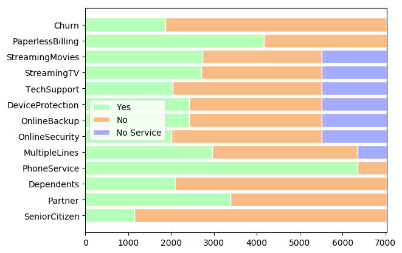


```
r = [0]
#Month-to-month    3875
#Two year          1695
#One year          1473
#Name: Contract, dtype: int64

b1 = pyplot.barh(r, width = 3875, color='#b5ffb9', edgecolor='white', height=.01)
b2 = pyplot.barh(r, width = 1473, left = 3875, color='#f9bc86', edgecolor='white', height=.01)
b3 = pyplot.barh(r, width = 1695, left = 3875+1473, color='#a3acff', edgecolor='white', height=.01)

pyplot.yticks(r, '')
pyplot.title('Contract')
pyplot.legend((b1,b2,b3), ('Month-to-month','One year','Two year'),loc=10)
pyplot.show()
```


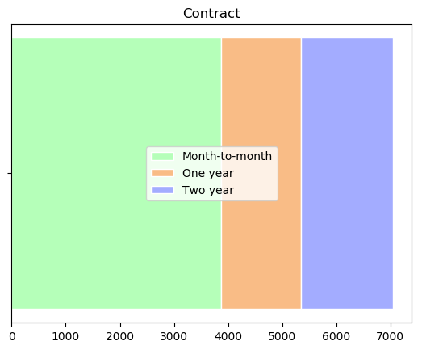


```
r = [0]

#Electronic check             2365
#Mailed check                 1612
#Bank transfer (automatic)    1544
#Credit card (automatic)      1522
#Name: PaymentMethod, dtype: int64

b1 = pyplot.barh(r, width = 2365, color='#b5ffb9', edgecolor='white', height=.01)
b2 = pyplot.barh(r, width = 1612, left = 2365, color='#f9bc86', edgecolor='white', height=.01)
b3 = pyplot.barh(r, width = 1544, left = 2365+1612, color='#a3acff', edgecolor='white', height=.01)
b4 = pyplot.barh(r, width = 1522, left = 2365+1612+1544, color='red', edgecolor='white', height=.01)

pyplot.yticks(r, '')
pyplot.title('Payment')

pyplot.legend((b1,b2,b3,b4), ('Electronic check','Mailed check','Bank transfer (automatic)','Credit card (automatic)'),loc=10)
pyplot.show()
```


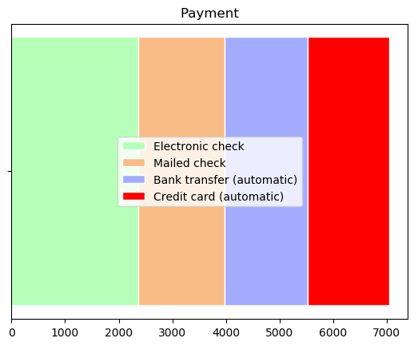


```
r = [0]
b1 = pyplot.barh(r, width=sum(readold_df['gender']=='Female'), color='#b5ffb9', edgecolor='white', height=.01)
b2 = pyplot.barh(r, width = sum(readold_df['gender']=='Male'), left = sum(readold_df['gender']=='Female'), color='#f9bc86', edgecolor='white', height=.01)

pyplot.yticks(r, '')
pyplot.title('Gender')

pyplot.legend((b1,b2), ('Female','Male'),loc=10)
pyplot.show()

```


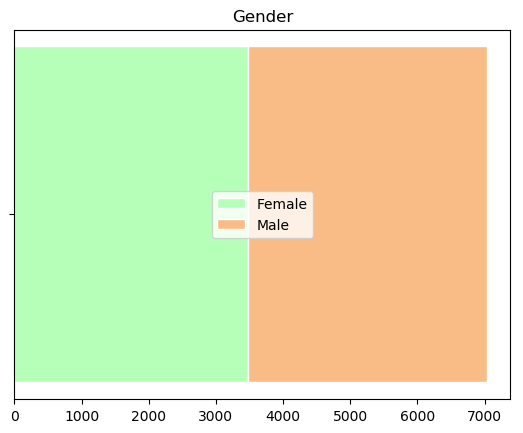


I will now examine summary statistics and counts of the variables in our dataset.


```
import pylab as pl
data_df.loc[data_df['OldCustomer'],'tenure'].astype(int).hist()
pl.suptitle("Customer tenure")
```


    Text(0.5, 0.98, 'Customer tenure')


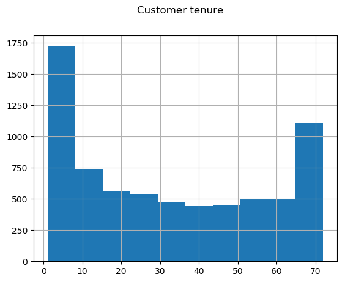


```
data_df.loc[data_df['OldCustomer'],'TotalCharges'].astype(int).hist()
pl.suptitle("Total charges")
```


    Text(0.5, 0.98, 'Total charges')


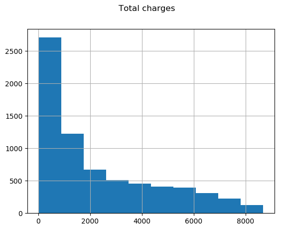


```
data_df.loc[data_df['OldCustomer'],'MonthlyCharges'].astype(int).hist()
pl.suptitle("Monthly charges")
```


    Text(0.5, 0.98, 'Monthly charges')


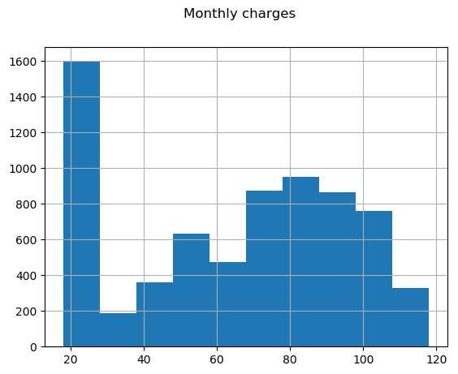


We have roughly equal numbers of male and female customers and about 1/5 senior citizens. Most do not have a partner and most do not have dependents. Most have phone service and most have internet service. Add-on services such as multiple phone lines and online security are fairly popular. Most customers use paperless billing. The most popular form of payment is an electronic check. Month-to-month is the most popular form of contract. Customers pay from  18.80 to 118.75 per month. Monthly charges seem to be bimodally distributed. About 1600 customers pay around $20, and the distribution of monthly charges among the remainder is roughly bell shaped and centered around $85. Customer tenure ranges from zero (a brand new customer) to to 72 months, with a lot of customers at both ends of the distribution and fewer in between. It may be the case that no customers have longer tenure because Telco has only been offering service for six years. It is also possible that customer tenure is censored at 72 months. Customers' cumulative spending ranges from under $20 (probably representing a single month of billing for basic phone service) to $8684.80, with most customers closer to the low end.

Almost 2000 customers out of fewer than 8000 'churned' (i.e. cancelled their service in the last month) - a surprisingly high proportion. It's hard to imagine how a telephone company that loses 1/4 of its customers every month could stay in business very long. Maybe this sample was taken from some group that tends to have high attrition and is not representative of the population of Telco customers. If this is a representative sample of Telco customers, then this suggests Telco may be rapidly losing market share.

Next, I will examine how our predictors are related to one another using Spearman rank-order correlation. The possible values go from one, representing a perfect positive monotone relationship in which the ranks of one variable perfectly correspond to the ranks of another (the highest, second highest, third highest measures, and so on, occur in the same individuals, respectively), to zero, representing no association, to negative one, representing a perfect inverse monotone relationship (the lowest value of one variable corresponds to the highest value of the other, the second lowest to the second highest, and so on). This works for both continuous variables and zero-one coded dichotomous variables. A dichotomous variable has only two possible ranks - every value is either the highest or the lowest, and which value is which is somewhat arbitrary. I am using 1 to denote 'True' and 0 to denote 'False' for every variable, which I think makes interpreting the direction of an association intuitive. If I am measuring the association between a dichotomous variable and a continuous variable, a positive association means that a value of 'True' on the dichotomous variable is associated with higher values of the continuous variable, which makes sense to me. Pairs of variables with Spearman correlation between .5 and -.5 are shaded in the heatmap below.


```
from rfpimp import plot_corr_heatmap
data_whole_df = data_df[data_df['OldCustomer']]
viz = plot_corr_heatmap(data_whole_df.drop(['customerID','Churn','OldCustomer'],axis=1), 0.49, figsize=(15,15))
```


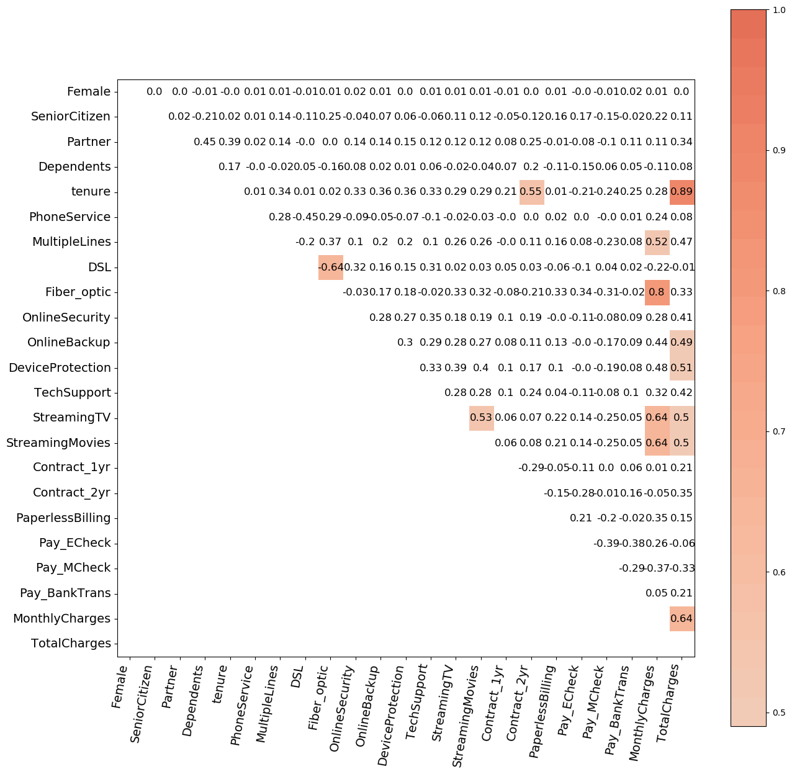


Some pairs of variables are correlated for obvious reasons. There is a negative relationship between DSL and Fiber optic internet service because one can have one or the other or neither, but not both. Add-on services like multple phone lines, streaming TV and movies, device protection and online backup tend to be positively correlated with monthly and total charges, which is to be expected, because these services cost extra. Streaming TV and movies are correlated with one another. It makes sense that people who like to watch streaming movies would also like to watch streaming TV. Interestingly, having a 2 year contract is positively correlated with tenure of customership. People in 2 year contracts tend to have been customers for a longer time.

Total charges are correlated with monthly charges and with tenure. I will further explore these relationships below.


```
pair_df = pandas.DataFrame(data_whole_df[["tenure","MonthlyCharges","TotalCharges"]],dtype=float)
sns.pairplot(pair_df)

```


    <seaborn.axisgrid.PairGrid at 0x1b0d4110>


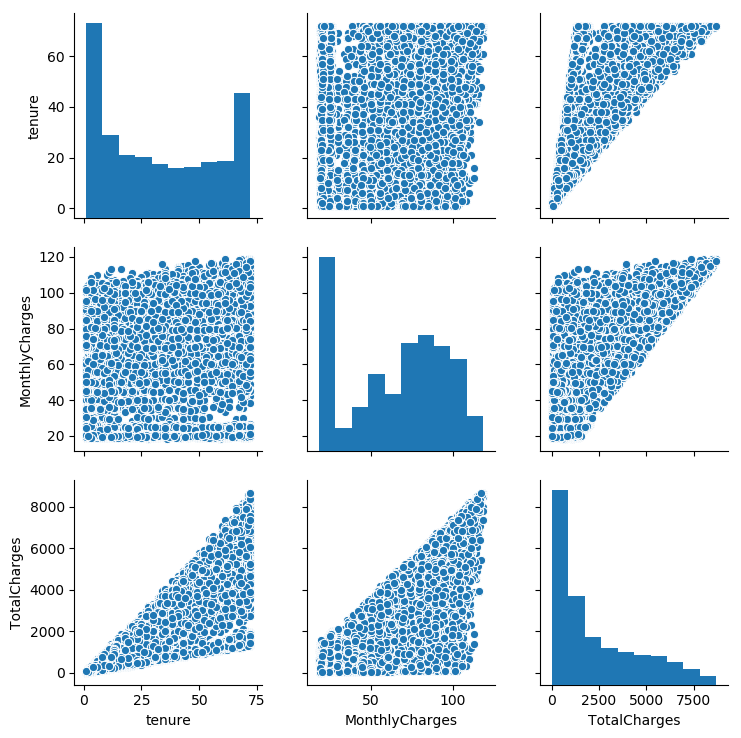


There doesn't seem to be any relationship between tenure and monthly charges, nor would be necessarily expect one. In the scatterplot of MonthlyCharges against TotalCharges, all the points seem to lie below an invisible and slightly wavy line, indicating that a customer's total charges are never above some multiple of their monthly charges, plus or minus some wiggle room. If each customer pays approximately the same amount every month, then their total billing can be slightly but not much more than their monthly bill times the maximum tenure (72 months). In fact, we find that the maximum total billing amount in our sample (around 8500) is just slightly higher than the product of the maximum tenure and maximum monthly bill (around 120). The plot of total charges against customer tenure is wedge-shaped. There is are effective minimum and maximum amounts that an individual can pay each month, and one's total billing has to be in between the product of one's tenure with these two amounts. 

One implication of this is that total billing is mostly a function of tenure and monthly bill. If we want to extract some useful information from this variable, we should find a way to correct for these other two variables and capture whatever remains. One way to do this is to divide the product of tenure and monthly billing by total billing. I will call this the historical billing quotient or HBQ. It represents the current month's billing in proportion to the average of previous months. If it is greater than 1, that means the customer is paying more than they have on average over the time they have been a customer.


```
HBQ_whole = data_whole_df["TotalCharges"]/(data_whole_df["tenure"]*data_whole_df["MonthlyCharges"])
data_whole_df.assign(HBQ = HBQ_whole)

plot_df = pandas.DataFrame(data_whole_df[["tenure","HBQ"]],dtype=float)
plot_df.plot(kind="scatter", x="tenure", y="HBQ")

plot2_df = pandas.DataFrame(data_whole_df[["MonthlyCharges","HBQ"]],dtype=float)
plot2_df.plot(kind="scatter", x="MonthlyCharges", y="HBQ")
```


    <matplotlib.axes._subplots.AxesSubplot at 0x1bd76870>


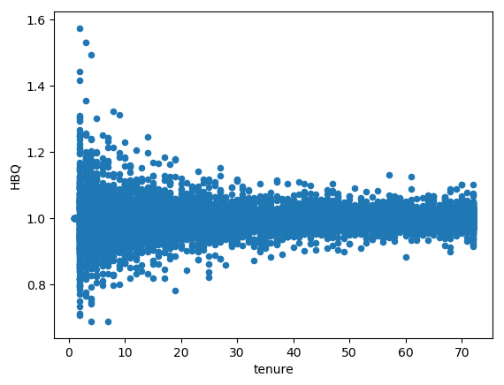


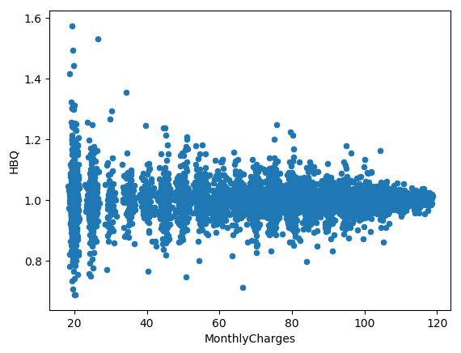


Brand new customers are paying 100% of their historical average because the current month is all they have (i.e. these are recent customers). HBQ of recently acquired customers has a fairly wide spread around 1, possibly because they are adding or dropping services in the early months of their tenure as customers as they figure out what services they want. The HQB of longtime customers is closely distributed around 1, possibly because these customers know what they want and have been getting the same services and paying the same amount for a long time. In any case, HBQ gives us a measure of historical spending relative to tenure and current spending, foregrounding the unique information contained in each customer's cumulative billing. It doesn't appear to be related to monthly billing or customer tenure. 

Monthly billing seems to contain a lot of redundant information. Customers pay for the services to which they subscribe, and this is reflected in monthly bills. Unfortunately, I don't know exactly how Telco prices their services, but many companies have a set price for each service and charge each customer the total of all services they sign up for. In this case, each customer's monthly bill would be equal to a linear combination of the dummy coded variables denoting the services to which they subscribe. In this case, a linear model containing all the customer's service choices would provide a perfect fit to monthly billing. I suspect this in not the case, because the scatter plots above suggest that monthly billing is continuous (at least down to the penny) as opposed to falling into a number of discreet amounts. There might also be some pay-as-you-go services which add additional charges not reflected in the customer's selection of services. I will fit a linear model with monthly billing as the outcome and service choices as the predictors and examine the residual plot to see what I can learn about Telco's pricing model.


```
from sklearn.linear_model import LinearRegression
X = data_whole_df[['PhoneService', 'MultipleLines', 'DSL', 'Fiber_optic','OnlineSecurity', 'OnlineBackup', 'DeviceProtection','TechSupport', 'StreamingTV', 'StreamingMovies']]
Y = data_whole_df['MonthlyCharges']
monthly_lm = LinearRegression().fit(X, Y)
monthly_pred = monthly_lm.predict(X)

pyplot.scatter(monthly_pred, Y,  color='black')
pyplot.plot(monthly_pred, monthly_pred, color='blue', linewidth=1)
pyplot.xlabel('Prediction')
pyplot.ylabel('Monthly Billing')
```


    Text(0, 0.5, 'Monthly Billing')


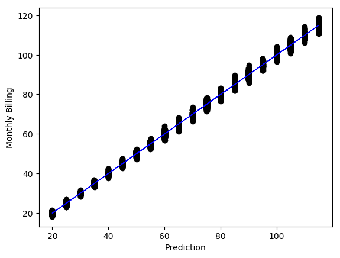


The predictions fall into about 20 discreet values, each representing a different combination of services. Monthly billing for each customer is within a few dollars of what we would predict given the services they chose. The difference must represent the amount of pay-as-you-go services each customer consumes. This is the information contained in monthly billing that we can't get from the customers service choices, which we already know. Instead of using raw monthly billing, which is largely redundant with service choices, I will consider using the residuals from this model, which I will call unexplained billing or UB. Before I proceed with this choice, I will examine another correlation heatmap, this time replacing total and monthly billing with HBQ and UB.


```
data_whole_df['UB'] = Y - monthly_pred
viz = plot_corr_heatmap(data_whole_df.drop(['customerID','Churn','OldCustomer','MonthlyCharges','TotalCharges'],axis=1), 0.49, figsize=(15,15))
```

    c:\users\michael nash\appdata\local\programs\python\python37-32\lib\site-packages\ipykernel_launcher.py:1: SettingWithCopyWarning: 
    A value is trying to be set on a copy of a slice from a DataFrame.
    Try using .loc[row_indexer,col_indexer] = value instead
    
    See the caveats in the documentation: http://pandas.pydata.org/pandas-docs/stable/indexing.html#indexing-view-versus-copy
      """Entry point for launching an IPython kernel.
    


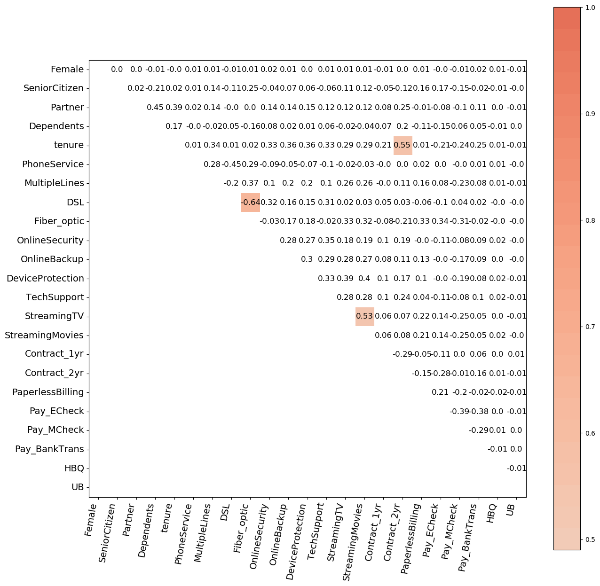


HBQ and UB are almost entirely unrelated to anything else we know about our customers. The only strong correlated pairs of features are between DSL and fiber optic (because they represent different levels of the same variable), streaming TV and streaming movies (similar services), and tenure and contract type (who knows?). Thus, I will drop monthly charges and total charges from the set of features used in prediction and include UB and HBQ instead.

Before I train the model, it is important to set aside some test data that will not be used for training. I will use this test data to evaluate the model. The purpose of this is to make sure that my model generalizes to new observations not used to train the model. Up to now, I have purposefully not examined the relationship between 'Churn' and any other variable in the dataset because I don't want this to affect the decisions I make in the model-training process. The relationship between 'Churn' and other variables in the test data shouldn't be incorporated into the model in any way.

I want to make sure that there are adequate numbers of customers who do and don't 'churn' in the training and test sets to be able to fit and evaluate a model using this as the outcome. I will randomly choose 1000 observations to constitute the test set, ensuring that the training and test sets contain a similar proportion of loyal customers. Individuals with zero tenure will be excluded for reasons described above. All others will be included in either the test or training sets.


```
p_churn = sum(data_whole_df['Churn']) / data_whole_df['Churn'].size
n_churn_test = int(round(p_churn*1000))
index_churn = data_whole_df.index[data_whole_df['Churn']&data_whole_df['OldCustomer']].tolist()
index_nochurn = data_whole_df.index[(data_whole_df['Churn']==False)&data_whole_df['OldCustomer']].tolist()
numpy.random.seed(12345)
index_churn_test= list(numpy.random.choice(index_churn,size=n_churn_test,replace=False))
index_churn_train = list(set(index_churn).difference(index_churn_test))
index_nochurn_test= list(numpy.random.choice(index_nochurn,size=1000-n_churn_test,replace=False))
index_nochurn_train = list(set(index_nochurn).difference(index_nochurn_test))
index_train = index_churn_train+index_nochurn_train
index_test = index_churn_test+index_nochurn_test
train_df = data_whole_df.loc[index_train]
test_df = data_whole_df.loc[index_test]
```

I will now train a random forest model using the training set and evaluate its performance on the test set. I will include HBQ, UB and tenure, but not TotalCharges or MonthlyCharges in the model, because these features are redundant.


```
from sklearn.ensemble import RandomForestClassifier as RFC

clf=RFC(n_estimators=200)
train1_df = pandas.DataFrame(train_df.drop(['customerID','TotalCharges','MonthlyCharges', 'Churn','OldCustomer'],axis=1),dtype = float)
test1_df = pandas.DataFrame(test_df.drop(['customerID','TotalCharges', 'Churn','MonthlyCharges','OldCustomer'],axis=1),dtype = float)
numpy.random.seed(12345)
clf.fit(train1_df,train_df['Churn'].astype(int))

y_prediction=clf.predict(test1_df)
xtab1 = pandas.crosstab(y_prediction.astype(bool),test_df['Churn'])

xtab1.index.name = 'Prediction'
print(xtab1)
```

    Churn       False  True 
    Prediction              
    False         679    140
    True           55    126
    


```
sens = xtab1.loc[1,1]/(xtab1.loc[1,1]+xtab1.loc[0,1])
spec = xtab1.loc[0,0]/(xtab1.loc[0,0]+xtab1.loc[1,0])
pcorrect = (xtab1.loc[1,1]+xtab1.loc[0,0])/1000
print('Sensitivity:',sens)
print('Specificity:',spec)
print('Proportion correct predictions:',pcorrect)

```

    Sensitivity: 0.47368421052631576
    Specificity: 0.9250681198910081
    Proportion correct predictions: 0.805
    


```
from dython.model_utils import binary_roc_graph as roc_graph
y_pred_prob=clf.predict_proba(test1_df)
roc_graph(test_df['Churn'].astype(int), y_pred_prob[:,1])
```


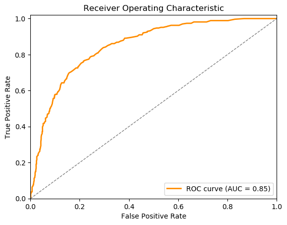


If I simply predict that anyone in the test set with predicted probability over .5 churns, and the rest don't, the model does a reasonably good job overall. Almost 80% of predictions on out-of-sample data are correct. Specificity is quite high; the model correctly predicts over 92% of customers who remain. Sensitivity is much lower;  the model correctly predicts just over 47% of customers who churn. However, I can pick any threshold I want for making predictions. Choosing a lower threshold for predicting a churning customer will give higher sensitivity and lower specificity. The ROC curve shows the tradeoff between sensitivity and specificity. The dotted line shows the sensitivity and specificity I would get by guessing at random. The model is much better than this. The AUC of the model applied to the test set is 0.85. This means that for any randomly selected pair of individuals discordant for churn, there is an 85% chance that the individual who churned will have higher predicted probability than the one who didn't.

Now that I am confident the model fits the data well, I would like to know which variables are important. Below, I explain the method I used for this. Feel free to skip the next two paragraphs if you just want to know which variables are important for prediction.

Permutation variable importance (PVI) measures this by assessing how much accuracy the model loses when a variable or set of variables are randomly permuted. If the model doesn't lose much predictive power, this means that the variable or variables don't provide much additional information about the outcome after accounting for all the others. I tried calculating PVI using different randomly chosen subsets of observations and found that the values changed quite noticeably. Even recalculating PVI with different permutations of feature values using the same training and test sets caused them to jump around quite a bit. Rather than present PVI values from a single run on a single random forest model fit to a single data set, I chose to fit 1000 random forest models to 1000 bootstrap samples from my original data set, assess permutation importance using out-of-bag observations, and present the median variable importance for each feature or set of features. Because the random forest method already incorporates resampling, there is probably a more computationally efficient way to get something similar (for example, by taking random samples of trees from a single random forest), but this way works well and is simple to implement.

Measuring PVI one variable at a time can be misleading when two features are strongly correlated. If there is some underlying characteristic that is important for prediction and measured by two different features, removing one and leaving the other won't affect prediction accuracy very much, but removing them both could have quite a large effect. With this in mind, I grouped dummy-coded features that represented a single categorical variable. I also combined streaming TV and movies because they are highly correlated.


```
from rfpimp import *
from statistics import mean
import random

clf=RFC(n_estimators=200)

nreps = 1000

features =  ['Female', 'SeniorCitizen', 'Partner', 'Dependents', 'tenure',
       'PhoneService', 'MultipleLines', ['DSL', 'Fiber_optic'],
       'OnlineSecurity', 'OnlineBackup', 'DeviceProtection',
       'TechSupport', ['StreamingTV', 'StreamingMovies'], ['Contract_1yr',
       'Contract_2yr'], 'PaperlessBilling', ['Pay_ECheck', 'Pay_MCheck',
       'Pay_BankTrans'], 'UB', 'HBQ']

feat_array = numpy.array(['Female', 'SeniorCitizen', 'Partner', 'Dependents', 'tenure',
       'PhoneService', 'MultipleLines', 'DSL\nFiber_optic',
       'OnlineSecurity', 'OnlineBackup', 'DeviceProtection',
       'TechSupport', 'StreamingTV\nStreamingMovies', 'Contract_1yr\nContract_2yr'
                          , 'PaperlessBilling', 
                          'Pay_ECheck\nPay_MCheck\nPay_BankTrans'
                          , 'UB', 'HBQ'])

set1_df = pandas.concat([train1_df,test1_df], axis = 0)
y1 = pandas.concat([train_df['Churn'].astype(int),test_df['Churn'].astype(int)])
n_train = y1.size-1000

tenure_25 = set1_df['tenure'].quantile(.25)
tenure_50 = set1_df['tenure'].quantile(.50)
tenure_75 = set1_df['tenure'].quantile(.75)

n_var = len(feat_array)

feat_labels = feat_array.copy()
feat_labels[feat_labels == 'Contract_1yr\nContract_2yr'] = 'Contract'
feat_labels[feat_labels == 'Pay_ECheck\nPay_MCheck\nPay_BankTrans'] = 'Payment'
feat_labels[feat_labels == 'DSL\nFiber_optic'] = 'DSL / Fiber optic'
feat_labels[feat_labels == 'StreamingTV\nStreamingMovies'] = 'Streaming TV / Movies'

dummyarray = numpy.empty((n_var,nreps))
dummyarray[:] = numpy.nan
var_imp_many_df = pandas.DataFrame(dummyarray)
cat_var_dict = dict(zip(range(n_var),feat_array))
var_imp_many_df.columns = range(nreps)
var_imp_many_df.rename(index=cat_var_dict,inplace=True)

c_month_vs_1yr = numpy.ones(nreps)
c_month_vs_2yr = numpy.ones(nreps)
c_1yr_vs_2yr = numpy.ones(nreps)

NI_vs_DSL = numpy.ones(nreps)
NI_vs_FO = numpy.ones(nreps)
DSL_vs_FO = numpy.ones(nreps)

tenure_75_vs_25 = numpy.ones(nreps)
tenure_75_vs_50 = numpy.ones(nreps)
tenure_50_vs_25 = numpy.ones(nreps)


for i in range(nreps):
    #numpy.random.seed(12345)
    
    
    index_all = set1_df.index.values
    numpy.random.seed(12345+i)
    index_train = list(numpy.random.choice(index_all,size=n_train,replace=True))
    index_test = list(set(index_all).difference(index_train))
    train_i_df = set1_df.loc[index_train]
    test_i_df = set1_df.loc[index_test]
    train_y_i = y1[index_train]
    test_y_i = y1[index_test]

    random.seed(12346+i)
    clf.fit(train_i_df,train_y_i.astype(int))
    numpy.random.seed(12347+i)
    I = importances(clf, test_i_df, test_y_i.astype(int), features=features,n_samples=500,sort=False)
    var_imp_many_df[i] = I['Importance']

    cont_as_1yr_df = train_i_df.copy()
    cont_as_1yr_df['Contract_1yr'] = True
    cont_as_1yr_df['Contract_2yr'] = False
    pred_train_cont_as_1yr = clf.predict_proba(cont_as_1yr_df)

    cont_as_2yr_df = train_i_df.copy()
    cont_as_2yr_df['Contract_1yr'] = False
    cont_as_2yr_df['Contract_2yr'] = True
    pred_train_cont_as_2yr = clf.predict_proba(cont_as_2yr_df)

    cont_as_month_df = train_i_df.copy()
    cont_as_month_df['Contract_1yr'] = False
    cont_as_month_df['Contract_2yr'] = False
    pred_train_cont_as_month = clf.predict_proba(cont_as_month_df)

    c_month_vs_1yr[i] = mean(pred_train_cont_as_month[:,1]-pred_train_cont_as_1yr[:,1])
    c_month_vs_2yr[i] = mean(pred_train_cont_as_month[:,1]-pred_train_cont_as_2yr[:,1])
    c_1yr_vs_2yr[i] = mean(pred_train_cont_as_1yr[:,1]-pred_train_cont_as_2yr[:,1])
    
    inet_as_DSL_df = train_i_df.copy()
    inet_as_DSL_df['DSL'] = True
    inet_as_DSL_df['Fiber_optic'] = False
    pred_train_inet_as_DSL = clf.predict_proba(inet_as_DSL_df)

    inet_as_Fiber_df = train_i_df.copy()
    inet_as_Fiber_df['DSL'] = False
    inet_as_Fiber_df['Fiber_optic'] = True
    pred_train_inet_as_Fiber = clf.predict_proba(inet_as_Fiber_df)

    inet_as_none_df = train_i_df.copy()
    inet_as_none_df['DSL'] = False
    inet_as_Fiber_df['Fiber_optic'] = False
    pred_train_inet_as_none = clf.predict_proba(inet_as_Fiber_df)

    NI_vs_DSL[i] = mean(pred_train_inet_as_none[:,1]-pred_train_inet_as_DSL[:,1])
    NI_vs_FO[i] = mean(pred_train_inet_as_none[:,1]-pred_train_inet_as_Fiber[:,1])
    DSL_vs_FO[i] = mean(pred_train_inet_as_DSL[:,1]-pred_train_inet_as_Fiber[:,1])
    
    tenure_as_25_df = train_i_df.copy()
    tenure_as_25_df['tenure'] = tenure_25
    pred_train_tenure_as_25 = clf.predict_proba(tenure_as_25_df)

    tenure_as_50_df = train_i_df.copy()
    tenure_as_50_df['tenure'] = tenure_50
    pred_train_tenure_as_50 = clf.predict_proba(tenure_as_50_df)

    tenure_as_75_df = train_i_df.copy()
    tenure_as_75_df['tenure'] = tenure_75
    pred_train_tenure_as_75 = clf.predict_proba(tenure_as_75_df)

    tenure_75_vs_25[i] = mean(pred_train_tenure_as_75[:,1]-pred_train_tenure_as_25[:,1])
    tenure_75_vs_50[i] = mean(pred_train_tenure_as_75[:,1]-pred_train_tenure_as_50[:,1])
    tenure_50_vs_25[i] = mean(pred_train_tenure_as_50[:,1]-pred_train_tenure_as_25[:,1])
```


```
var_imp_many_df.values.sort()
low_imp = var_imp_many_df[25]
high_imp = var_imp_many_df[974]
mid_imp = (var_imp_many_df[499] + var_imp_many_df[500])/2

pyplot.rcdefaults()
fig, ax = pyplot.subplots()
y_pos = np.arange(len(feat_labels))
ax.barh(y_pos, mid_imp, 
        #xerr=[mid_imp-low_imp,high_imp-mid_imp] , 
        align='center',color='green', ecolor='black')
ax.set_yticks(y_pos)
ax.set_yticklabels(feat_labels)
ax.invert_yaxis()  # labels read top-to-bottom
ax.set_xlabel('Median Variable Importance')
ax.set_title('Permutation Variable Importance')
plt.show()

```


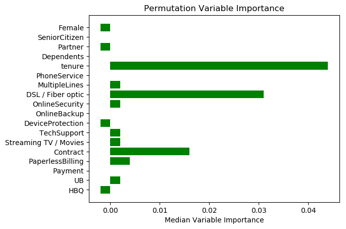


For features which actually add nothing to the prediction of the outcome, scrambling their values is just as likely to help prediction as hurt it. The expected PVI for a non-informative feature is zero, but the actual value will vary somewhat from one sample and one model to another. Features or groups of features that provide a lot of unique information which helps predict churn (i.e. provide information about which customers will churn that we can't get from other features or groups of features) will tend to have high PVI relative to others.

Customer tenure, type of contract and type of internet service seem to be the most important, so I will focus on these. Now I want to know how the (predicted) probability differs as a function of each of these variables when all others are held constant. Below, I explain the method I used for this. Feel free to skip the rest of this cell if you just want to know the effect of tenure, type of contract and type of internet service on customer churn.

With a parametric model like the logistic regression model, the coefficient estimates could be used as estimates of the associated difference in odds (not the same as probability, but one has a simple arithmetic relationship to the other) associated with a 1-unit change in a covariate. The random forest model itself is not interpretable. The predictions, however, can be interpreted. The partial dependence method provides a way to answer my question using predictions from the model:

1) Pick a feature (or set of features) I want to know about and levels I want to compare to one another
2) Set the value of this feature to each level (but keep all others as they are) for each individual and get a prediction for each individual at each level
3) Calculate the difference in predicted probability between each pair of feature levels for each individual and take the average of the differences (which is equal to the difference in the averages) for each pair of levels

This method doesn't require a test set because it is simply a method for interpreting the model, not evaluating it.The average difference in predicted probability between two levels of a feature gives us an estimate of the difference in probability associated with the difference in levels of that feature averaged across all values of all other features in the population. The effect of a given feature may not be linear or constant across all levels of all other features. The random forest model does not make any assumptions about the form of the relationship between any given feature and the outcome and implicitly considers interactions up to the level of the tree depth one specifies. I used the default tree depth, which is the square root of the number of features. One could explore interactions of interest by comparing predicted probabilities for combinations of features, but there were no interactions that I thought would be particularly informative to explore in this example.

As long as the sample used is representative of the population one wants to know about, this method can be used to understand the relationship between a feature and an outcome conditioned on other features. However, the mean difference in predicted probability between two levels of a feature depends not only on how variables are related in the study population, but how each variable is distributed. It wouldn't be valid to apply my conclusions to a different population of customers with different characteristics. They only apply to the population of customers from which this sample was taken.

Below are the results I obtained using the partial dependence method with one feature at a time. I trained the model on 1000 bootstrap samples and calculated 1000 separate estimates for the difference in probability associated with each pair of feature values. The plot below shows the median of estimated mean differences from the 1000 runs with a 95% confidence interval obtained by taking the .025 and .975 quantiles of the estimated mean difference. This is the method proposed by Cafri and Bailey (2016). As before, there may be a more efficient way to do this.


```
c_month_vs_1yr.sort()
c_month_vs_2yr.sort()
c_1yr_vs_2yr.sort()
NI_vs_DSL.sort()
NI_vs_FO.sort()
DSL_vs_FO.sort()
tenure_75_vs_25.sort()
tenure_75_vs_50.sort()
tenure_50_vs_25.sort()


est_diff_cols = numpy.column_stack(
    [c_month_vs_1yr,
     c_month_vs_2yr,
     c_1yr_vs_2yr,
     -NI_vs_DSL,
     -NI_vs_FO,
     -DSL_vs_FO,
     -tenure_75_vs_25,
     -tenure_75_vs_50,
     -tenure_50_vs_25])

est_diff_colnames =['Contract: Monthly vs 1yr',
               'Contract: Monthly vs 2yr',
               'Contract: 1yr vs 2yr',
               'DSL vs No internet ',
               'Fiber optic vs No internet',
               'Fiber optic vs DSL',
               'Tenure: 25th vs 75th percentile',
               'Tenure: 50th vs 75th percentile',
               'Tenure: 25th vs 50th percentile']

est_diff_df = pandas.DataFrame(est_diff_cols)
est_diff_df.columns = est_diff_colnames
```


```
low_diff = est_diff_df.loc[25,:]
high_diff = est_diff_df.loc[974,:]
mid_diff = (est_diff_df.loc[499,:] + est_diff_df.loc[500,:])/2

from matplotlib import pyplot

pyplot.rcdefaults()
fig, ax = pyplot.subplots()
y_pos = np.arange(len(est_diff_colnames))
ax.barh(y_pos, 100*mid_diff, xerr=[100*(mid_diff-low_diff),100*(high_diff-mid_diff)] , align='center',
        color='green', ecolor='black')
ax.set_yticks(y_pos)
ax.set_yticklabels(est_diff_colnames)
ax.invert_yaxis()  # labels read top-to-bottom
ax.set_xlabel('Mean Change in Predicted Probability')
#ax.set_title('Permutation Variable Importance')
plt.show()
```


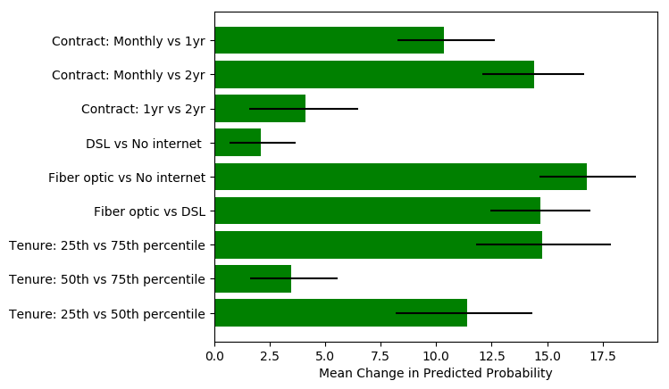


```
est_df = pandas.DataFrame(numpy.column_stack([100*mid_diff,100*low_diff,100*high_diff]),columns=['Estimate','Lower Bound','Upper Bound'],index=est_diff_colnames)
print('25th, 50th and 75th percentiles of customer tenure:',tenure_25,tenure_50,tenure_75)
est_df
    
```

    25th, 50th and 75th percentiles of customer tenure: 9.0 29.0 55.0
    


<div>
<style scoped>
    .dataframe tbody tr th:only-of-type {
        vertical-align: middle;
    }

    .dataframe tbody tr th {
        vertical-align: top;
    }

    .dataframe thead th {
        text-align: right;
    }
</style>
<table border="1" class="dataframe">
  <thead>
    <tr style="text-align: right;">
      <th></th>
      <th>Estimate</th>
      <th>Lower Bound</th>
      <th>Upper Bound</th>
    </tr>
  </thead>
  <tbody>
    <tr>
      <th>Contract: Monthly vs 1yr</th>
      <td>10.332932</td>
      <td>8.247577</td>
      <td>12.628812</td>
    </tr>
    <tr>
      <th>Contract: Monthly vs 2yr</th>
      <td>14.428632</td>
      <td>12.082156</td>
      <td>16.672935</td>
    </tr>
    <tr>
      <th>Contract: 1yr vs 2yr</th>
      <td>4.105311</td>
      <td>1.596843</td>
      <td>6.489755</td>
    </tr>
    <tr>
      <th>DSL vs No internet</th>
      <td>2.125222</td>
      <td>3.670551</td>
      <td>0.689366</td>
    </tr>
    <tr>
      <th>Fiber optic vs No internet</th>
      <td>16.799536</td>
      <td>18.992869</td>
      <td>14.642169</td>
    </tr>
    <tr>
      <th>Fiber optic vs DSL</th>
      <td>14.705117</td>
      <td>16.964204</td>
      <td>12.440262</td>
    </tr>
    <tr>
      <th>Tenure: 25th vs 75th percentile</th>
      <td>14.769546</td>
      <td>17.862693</td>
      <td>11.783360</td>
    </tr>
    <tr>
      <th>Tenure: 50th vs 75th percentile</th>
      <td>3.475021</td>
      <td>5.580239</td>
      <td>1.615524</td>
    </tr>
    <tr>
      <th>Tenure: 25th vs 50th percentile</th>
      <td>11.384739</td>
      <td>14.348543</td>
      <td>8.182670</td>
    </tr>
  </tbody>
</table>
</div>


This plot shows the mean difference in probability for the same observation when a given feature is set to a given value compared to some other value with 95% confidence intervals. For example, 'Contract: Monthly vs 1yr' represents the mean difference between predicted values given a monthly contract compared to a 1 year contract. The difference is positive, indicating that the predicted probability of attrition is higher when the individual is in a monthly contract compared to a 1 year contract.

All other things being equal, the probability of churn associated with having a monthly contract is 10.3 percentage points higher on average (95% CI from 8.2 to 12.6) than with a 1 year contract and 14.4 percentage points higher on average (95% CI from 12.1 to 16.7) than with a 2 year contract. The average difference between a 1 year and 2 year contract is 4.1 percentage points (95% CI from 1.6 to 6.5). In general, longer contracts are associated with less customer attrition, but the difference between monthly and annual or bi-annual contracts is greater than the difference between the latter two kinds. This helps explain why customer tenure is related to contract type: customers in longer contracts are less likely to leave in any given month, so they tend to stay longer. I can't say for sure on the basis of an observational study that monthly contracts cause higher attrition; some type of experiment would be needed to determine that. Telco might want to study the effect of getting customers into longer contracts by offering them additional incentives as a way to improve customer retention.

The probability of churn associated with fiber optic service is 16.8 percentage points higher on average (95% CI from 14.6 to 19.0) than with no internet service and 14.7 percentage points higher on average (95% CI from 12.4 to 17.0) than DSL service. Telco should investigate why customers with fiber optic service are so much more likely to leave. It may be that customer dissatisfaction with fiber optic service is unusually high or some competitor may be offering an attractive deal on fiber optic service. The probability of churn associated with DSL service is only 0.6 percentage points higher on average (95% CI from 1.9 to -0.7). A confidence interval that passes through zero indicates that this difference is not statistically significant. 

The probability of churn associated with being at the 25th percentile of tenure (9 months) is 11.4 percentage points higher on average (95% CI from 8.2 to 14.3) than being at the 50th percentile (29 months) and 14.8 percentage points higher on average (95% CI from 11.8 to 17.9 ) than being at the 75th percentile (55 months).The probability of churn associated with being at the 50th percentile is 3.5 percentage points higher on average (95% CI from 1.6 to 5.6) than being at the 75th percentile. The older the customer, the less likely they are to leave. This is intuitive, because old customers have a long history of not leaving, and past behavior is often a good predictor of future behavior. It doesn't make sense to try to lengthen customers' tenure except to the extent that we want new customers to keep new customers until they become old customers and then continue to hold onto them. Telco could decide to focus customer retention efforts on new customers, who are more likely to leave, but a better strategy would be to use the model to identify those likely to churn.

The insights gained from any model are only as good as the model itself. This one is pretty good, but that doesn't mean there isn't a better model for this data. The great thing about the permutation variable importance and partial dependence methods is that they are model agnostic. If I later find that a gradient boosting machine or support vector machine does a better job predicting customer churn from the other customer information available to me, I can easily use the same set of tools to identify important features and provide estimates of their conditional association with probability of churn.
